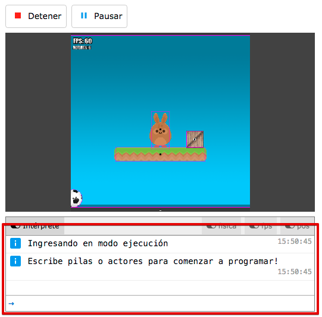
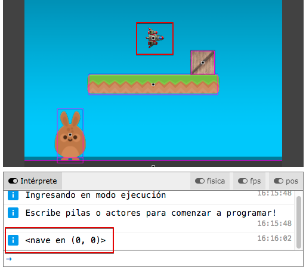
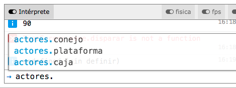

# El intérprete

Cuando se habla de programación generalmente se dice que la computadora sigue nuestras órdenes, que podemos pedirle que haga lo que nosotros queremos y de qué forma tiene que hacer cada cosa.

Eso es cierto, de hecho, por eso para controlar las computadores tenemos que aprender al menos un "lenguaje" (como javascript) que entienda la computadora para poder pedirle cosas.

El intérprete es como un "canal de chat", en donde podemos comunicarnos directamente con la computadora y esperar respuestas.

Para mostrar brevemente lo que puede hacer el intérprete pulsá el botón "Ejecutar", para poner el juego en funcionamiento y luego abrí el intérprete:



Justo a la derecha de esa flechita azúl, escribí un mensaje algunos mensajes para ver si la computadora comprende lo que le pedimos:

```
2+2
1231244123+399120930
```

El intérprete va a responder a cada una de las cuentas con el resultado, como si fuera una calculadora aritmética.

Sin embargo, hace más que eso, si le pedimos incorrectamente algo nos dará un mensaje de error:

```
2 + numero
```


Y esto está bien, si bien el texto rojo parece algo grave, no lo es. La computadora nos explica que no sabe de que se trata "numero" y por lo tanto no sabría decirnos el resultado de esa cuenta.

Si le indicamos que el "numero" es, por ejemplo `10` sí va a poder decirnos el resultado:

```
numero = 10
2 + numero
```


¡Claro!, el resultado es `12` ya que creamos una variable llamada "numero" con el valor de 10.

## Accediendo a las variables pilas y actores

Ahora bien, el intérprete no solo puede realizar cuentas aritméticas, también puede colocar objetos en la pantalla del juego, nos permite realizar pruebas y también cambiar cosas.

Existe una variable declarada por el propio entorno llama "pilas". Esta variable nos permite acceder a toda la funcionalidad de pilas de forma "programática".

Hagamos una prueba, escribí:

```
nave = pilas.actores.nave()
```


Cuando pulses "enter" deberán pasar dos cosas. Por un lado, aparecerá un actor nuevo en la pantalla y por el otro, el intérprete nos dirá `<nave en (0, 0)>`:



Si haces click en la pantalla, vas a notar que la nave está "viva", se puede mover y disparar usando el teclado.

Sin embargo, también se va a poder controlar desde el intérprete, usando código.

Escribí lo siguiente para realizar más pruebas:

```
nave.escala = 2
nave.rotacion = 90
nave.decir("hola")
```


Esto es bastante útil, porque el código que escribimos en el intérprete también se puede trasladar al editor. Si tenemos dudas sobre alguna función o forma de hacer algo en pilas podemos probar en el intérprete, y si todo sale bien, llevarlo al editor y que forma parte de nuestro juego.


También existe otra variable llamada "actores" desde donde podemos acceder a otros actores en la escena. Para usar esta variable simplemente escribí "actores." seguido del nombre del actor que quieras programar.

Vas a notar que el intérprete viene con una funcionalidad completado de código bastante útil, así que no hace falta escribir todas las letras cada vez.

Por ejemplo, en mi caso, tengo una escena con 3 actores, así que el intérprete ya me adelanta cómo se llaman esos actores con su completado de código:



